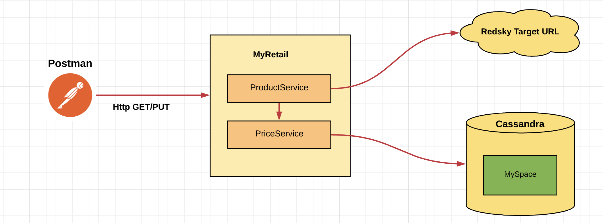

# MyRetail Case Study

This MyRetail Case Study service is a Spring Boot application to expose REST APIs to GET product details from a target redsky endpoint and NoSql DB and PUT Product pricing in a NoSql Database



## How to use this service?

Please follow the instructions below.
What is needed?

Java Major Version : 1.8
IDE : IntelliJ Idea
NoSql Database : Cassandra
To Test : Postman

## Install Cassandra 

I have used Mac OS laptop to demonstrate this application.
Please follow the steps below to bring up a single node Cassandra instance. (Mac OS)

1. Open Terminal and run the following command
```command
brew install cassandra
```

2. Once done navigate to the following location
```command
/usr/local/etc/cassandra
```

3. Start Cassandra Locally
```command
brew services start cassandra
```

4. Once Started, Issue the following command to get CQL prompt
```command
cqlsh
```

5. Create Keyspace. Keyspace is similar to Schema in traditional RDBMS.
```command
cqlsh> create keyspace pricedemo with replication = {'class':'SimpleStrategy','replication_factor':1};
```

6. Set the Default Keyspace. Once this is done, all our DB objects will be created in the default keyspace that is set.
```command
cqlsh> use pricedemo;
```

7. Create table ProductPriceEntity to hold some data for the demo
```command
cqlsh:pricedemo> create table productpriceentity(productid varchar primary key, price varchar, currency_code varchar);
```

8. Run the following insert statements to create records
```command
cqlsh:pricedemo> insert into productpriceentity (productid, price, currency_code) values ('1111','199.99','USD');
cqlsh:pricedemo> insert into productpriceentity (productid, price, currency_code) values ('1112','299.99','USD');
cqlsh:pricedemo> insert into productpriceentity (productid, price, currency_code) values ('1113','399.99','USD');
cqlsh:pricedemo> insert into productpriceentity (productid, price, currency_code) values ('13860428','399.99','USD');
```


## Clone the Application

. Using git clone command, Clone the application using the URL
. Navigate to the project folder.
. git checkout master

## run the application.

1. Open the project in IntelliJ Idea or the IDE of your choice
2. Start the application as Springboot application.

## Test the application

I have used postman for this purpose
To use Postman, bring up the postman and issue the following commands.

```GET
GET http://localhost:9100/products/13860428
```

and the response will be (for valid product id)
```
{
    "id": 13860428,
    "name": "\"The Big Lebowski (Blu-ray)\"",
    "current_price": {
        "value": 1111.99,
        "currencyCode": "\"usd\""
    }
}
```

for invalid product id
```
{
    "errorDescription": "ProductPriceEntity Not Found",
    "errorDetails": [
        "404 Not Found"
    ]
}
```

and now issue a PUT command
```PUT
PUT http://localhost:9100/products/updateproduct/13860428/price

and Body 
{
    "id": 13860428,
    "name": "\"The Big Lebowski (Blu-ray)\"",
    "current_price": {
        "value": 1111.99,
        "currencycode":"usd"
    }
}

with data type as JSON(application/json)
```
Successful update will return the Updated Project JSon back and status code of 200

If a product is not found in Cassandra, by PUT standard, it will create a new entry in DB table.


##Using Swagger

Open any browser http://localhost:9100/swagger-ui.html
and remaining is self explanatory


 
